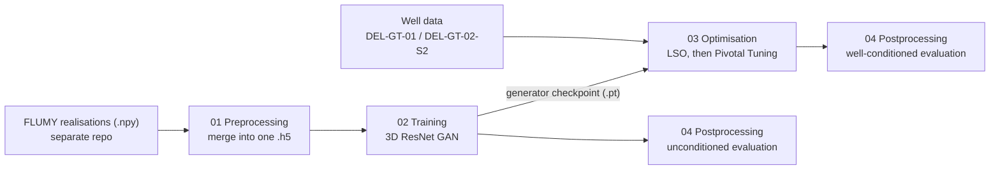

# FaciesGAN-3D

FaciesGAN-3D is a Generative Adversarial Network model created to reproduce 3D-geological facies models on a HPC-environment. The model was created for a graduation project on leveraging the power of Deep Learning for creating ensembles of 3D geomodels. The code of the FaciesGAN model(s) are built on previous work done by:

- 1:[Guillaume Rongier](https://github.com/grongier) & [Luk Peeters](https://www.researchgate.net/profile/Luk-Peeters): [Towards geological inference with process-based and deep generative modeling](https://arxiv.org/abs/2510.14445)
- 2:Ferdinand Bhavsar, Nicolas Desassis, Fabien Ors, Thomas Romary: [A stable deep adversarial learning approach for geological facies generation](https://www.sciencedirect.com/science/article/pii/S0098300424001213?via%3Dihub)

The full thesis, *Evaluating the applicability of Generative Adversarial Networks for geological facies modelling: A case study on the Delft Geothermal Reservoir*, is included in [`report/MSc_thesis_M_D_Torres_Ruhe.pdf`](report/MSc_thesis_M_D_Torres_Ruhe.pdf).

## Summary of results

The project tested whether a modified FluvGAN architecture can generate geologically plausible 3D realisations of the Delft Sandstone Member (DSST), the reservoir of the Delft Geothermal Project, while being conditioned to the sparse facies observations of the DEL-GT-01 and DEL-GT-02-S2 wells. Because no real 3D training data exist for this reservoir, the training data were synthetic. The process-based simulator FLUMY generated them for three fluvial-deltaic parameter settings (net-to-gross 67 %, channel depth 5–7 m). Each realisation is a $32 \times 128 \times 128$ voxel grid ($20 \times 20 \times 1$ m voxels). Its facies were grouped into three lithological associations to match the core interpretations: channel & point bar, levee & crevasse, and overbank fines.

Main findings:

- **Training stability depends on architecture and regularisation.** A deep 3D ResNet with double convolutions and double residual blocks, combined with an R1 gradient penalty applied every 16 discriminator iterations, gave the most stable model ("Model 5": JSD $= 0.0155$, normalised spatial entropy $= 0.704$ vs. $0.692$ for the FLUMY baseline). Simpler architectures, a 2:1 discriminator update ratio, or halving the training set to 10,000 samples all led to mode collapse or structural degradation. At least 20,000 training samples were needed.
- **The unconditioned GAN reproduces large-scale structure but misses fine-scale detail.** The optimised 3-class model approximates global facies proportions and channel-belt trends. Local artefacts remain, however: isolated minority-facies voxels (~30 % excess unique local patterns), discontinuous mud plugs and closed channel loops.
- **High-fidelity and multi-prior models collapse.** Expanding to 9 facies classes caused the generator to drop rare facies (< 0.1 % volume). The extreme class imbalance (> 65 % point bar sand) is the likely cause. Training one model on all three FLUMY settings combined also resulted in ensemble mode collapse under the baseline hyperparameters.
- **MS-SWD alone is not sufficient for evaluation.** The Multi-Scale Sliced Wasserstein Distance is fast enough to use during training, but because it relies on 1D projections it did not detect mode collapse in several runs. Voxel-wise spatial entropy proved to be the decisive diversity metric.
- **Well conditioning works, but the results are preliminary.** A two-step inversion conditioned the realisations to both wells: Latent Space Optimisation (LSO), followed by Pivotal Tuning (PT) of the generator weights. The conditioned realisations reached mean Macro F1-scores of 0.70–0.91 and categorical match accuracies of 0.78–0.92 along the well trajectories, while keeping stochastic variability in the inter-well region. However, the PT losses had not converged within 1,000 iterations, so these numbers are indicative only. Conditioning also introduced local artefacts and an uneven entropy reduction near the wellbores.

Overall, GANs offer a fast route to large, conditioned 3D geomodel ensembles. They involve clear trade-offs between conditioning precision, training stability and local geological realism. Training took 3–5 h (25 epochs) to ~20 h (100 epochs) on 2× NVIDIA A100 (80 GB). LSO and PT for 100 realisations took ~1.5 h and ~2.5 h respectively.

## Installation

You can install all the packages needed to run the preprocessing & postprocessing scripts using [conda](https://anaconda.org/channels/anaconda/packages/conda/overview) and the `faciesgan_environment.yml` file included in this repository:
```bash
conda env create -f environments/faciesgan_environment.yml
```

In addition, when running the training and optimisation scripts for which this project used a Linux cluster, you may use the `faciesgan_environment_hpc.yml` file included in this repository:
```bash
conda env create -f environments/faciesgan_environment_hpc.yml
```

> **Note:** The GAN networks, losses, and the MS-SWD metric come from the [`voxgan`](https://pypi.org/project/voxgan/) package (v0.0.2) by G. Rongier, which both environments install via pip.

## Repository structure

```text
FaciesGAN-3D/
├── environments/            # Conda environment files (local + HPC)
├── report/                  # MSc thesis (PDF)
├── scripts/
│   └── gan_pipeline/
│       ├── core/            # Shared helpers: plotting style, facies colour map, dataloader, config utils
│       ├── 01_preprocessing/
│       ├── 02_training/
│       ├── 03_optimization/
│       ├── 04_postprocessing/
│       └── sandbox/         # Exploratory notebooks/scripts (not needed to reproduce results)
├── datasets/                # (git-ignored) FLUMY training/testing samples and well data
├── outputs/                 # (git-ignored) checkpoints, training histories, realisations
└── plots/                   # (git-ignored) figures produced by the pipeline
```

The `datasets/`, `outputs/` and `plots/` folders are not tracked because of their size. The scripts expect them to exist with the layout above. The synthetic FLUMY training data are generated with a separate FLUMY pipeline repository. This repository starts from the FLUMY output: one `.npy` file per realisation, holding an integer facies grid of shape `(Z, Y, X) = (32, 128, 128)`.

## GAN pipeline

The pipeline is organised in four numbered stages. The scripts are run on an HPC cluster, and the notebooks are used locally to analyse the results and make the figures in the thesis.



### `core/` – shared utilities
| File | Purpose |
| --- | --- |
| `custom_plots.py` | Global matplotlib style (`apply_custom_plotting_flavor`) and the `FaciesColorMap` used in all figures. |
| `facies_config.json` | Integer code and colour for each of the 13 FLUMY facies (+ background). |
| `dataloader.py`, `utils.py` | Shared versions of the dataset class and config helpers (see `02_training/`). |

### `01_preprocessing/` – building the training set
| File | Purpose |
| --- | --- |
| `preprocessing.py` | Collects realisations from one or more FLUMY output folders (`--data_dirs`), takes `--samples_per_dir` samples from each, optionally centre-crops one axis, and writes everything to a single HDF5 file with a `facies` dataset of shape `(N, Z, Y, X)`. Passing several folders creates the combined multi-prior dataset. |
| `datasets_visualization.ipynb`, `dataset_visualization_combined.ipynb` | Explore the FLUMY datasets: facies proportions, orthogonal slices and voxel-wise spatial entropy per setting (thesis Section 4.1). |

```bash
python preprocessing.py --data_dirs <setting_2>/samples/facies --output_file samples.h5 --samples_per_dir 20000
```

### `02_training/` – training the GAN
| File | Purpose |
| --- | --- |
| `training_cgan.py` | **Main training script used in the thesis.** Builds the FluvGAN "Architecture 4" generator/discriminator from `voxgan` (3D ResNet, spectral norm, double convolutions and double residual blocks, `tanh` output), trains it with a BCE adversarial loss, Adam ($\beta_1 = 0$), and R1 regularisation, and tracks a per-channel MS-SWD on a validation split. |
| `dataloader.py` | `FaciesDataset`: loads the `.h5` file into RAM, maps the raw FLUMY codes to 3 facies associations (or the 9 occurring facies with `--one_hot_all True`), and one-hot encodes each sample to a `C × 32 × 128 × 128` tensor scaled to $[-1, 1]$. |
| `utils.py` | Hybrid argument parsing (JSON config file + CLI overrides), config saving and dataset validation. |
| `visualize_and_generate.py` | Plots the loss history of a run and samples *N* unconditioned realisations from a checkpoint. |
| `model_architercture.ipynb` | Inspects the network layers and parameter counts (thesis Appendix C). |
| `training_mws-gan.py`, `training_mws-gan_pure_torch.py` | Experimental multi-scale WGAN (MSG-GAN) alternative; not used for the reported results. |

```bash
nohup python -u training_cgan.py \
    --run_name 25_epochs_3_classes_setting_2 \
    --data_file /path/to/samples.h5 \
    --output_dir /path/to/outputs \
    --num_gpus 2 --num_samples 20000 --epochs 25 \
    --batch_size 64 --val_batch_size 64 --validation_size 0.1 > training.out 2>&1 &
```

Each run folder contains `config.json`, `facies_mapping_config.json`, a `*_history.csv` with the losses and validation metrics, and the final generator/discriminator checkpoint (`.pt`). Learning rates, the R1 penalty frequency and the architectural toggles are set directly in the body of `training_cgan.py`; the CLI only covers data, run and batch settings.

### `03_optimization/` – conditioning to well data (inversion)
| File | Purpose |
| --- | --- |
| `fluvgan_latent_optimization.py` | **Step 1 – Latent Space Optimisation.** Keeps the trained generator frozen and optimises a batch of latent vectors $z$. The loss combines a distance-thresholded context loss on the well voxels with a discriminator-based prior loss ($\lambda = 10$). It saves `optimized_z.npy`, the loss history and the conditioned realisations. |
| `fluvgan_pivotal_tuning.py` | **Step 2 – Pivotal Tuning.** Uses the optimised $z$ vectors (one or several runs combined) as fixed anchors and fine-tunes the generator weights to match the wells exactly, with regularisation to preserve realism. It saves `tuned_generator.pt`, the tuning history and the realisations. |
| `wells.ipynb` | Loads the well surveys and the core facies interpretations, projects the DEL-GT-01 and DEL-GT-02-S2 trajectories into the model grid and visualises them. |

```bash
python fluvgan_latent_optimization.py --model_path <run>/<checkpoint>.pt \
    --well_data_path datasets/well_data/Well_data.xlsx --output_dir <lso_out> --n_samples 100 --steps 3000
python fluvgan_pivotal_tuning.py --model_path <run>/<checkpoint>.pt --optimized_z_path <lso_out>/optimized_z.npy \
    --well_data_path datasets/well_data/Well_data.xlsx --output_dir <pt_out> --batch_size 8 --steps 1000
```

### `04_postprocessing/` – evaluation and figures
| File | Purpose |
| --- | --- |
| `postprocessing.py` | `PostProcessing` class that compares a GAN ensemble with the FLUMY baseline: facies proportions, voxel-wise normalised entropy, slice-wise JSD, MS-SWD/MDS projections, connectivity and 3×3×3 pattern statistics, and 2D/3D visualisations. |
| `well_evaluation.py` | `WellMismatch` class for conditioned realisations: extracts the facies along the well paths, computes Macro F1 and accuracy, and plots well profiles, well-trajectory slices and near-well entropy. |
| `fluvgan_msswd_mds.py` | HPC script that computes MS-SWD distances between test data and several trained models and projects them with Multi-Dimensional Scaling. |
| `post_training_hyperpams.ipynb` | Hyperparameter ablation study (thesis Section 4.2.1). |
| `post_training_best_model.ipynb` | Detailed evaluation of the selected model trained for 100 epochs (thesis Section 4.2.2). |
| `post_training_high_fidelity.ipynb` | 9-class and multi-prior models (thesis Section 4.2.3). |
| `postprocessing_after_optimizing.ipynb` | Evaluation of the LSO results (thesis Section 4.3.1). |
| `postprocessing_after_editing.ipynb` | Evaluation of the Pivotal Tuning results (thesis Section 4.3.2). |

## License

Copyright notice: Technische Universiteit Delft hereby disclaims all copyright interest in the program fluvgan written by the Author(s). Prof.dr.ir. S.G.J. Aarninkhof, Dean of the Faculty of Civil Engineering and Geosciences

&#169; 2026, Mathias Ruhe

This work is licensed under a MIT OSS licence, see [LICENSE](LICENSE) for more information.